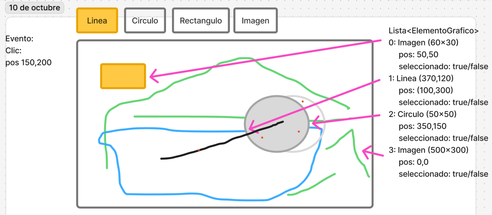

# Práctico 4 - Capacidad vectorial en imagenes

Se requiere hacer un programa que 
permite editar objetos graficos de 
manera vectorial a la manera de
Photoshop y programas similares.

El programa debe manejar una lista de
objetos graficos, estos objetos serán
de la clase ElementoGrafico. Los 
atributos de la clase elemento grafico
son: 
* int posX
* int posY
* boolean seleccionado

Y los metodos que las
subclases deben implementar son:
dibujar()
clicDentroDeObjeto(x,y):boolean

Los objetos de tipo ElementoGrafico
son: Linea, Circulo, Cuadrado, Imagen.

Cada uno de las subclases tienen atributos
particulares de acuerdo a lo que se 
necesite.

## Seleccionar un elemento

Como programa vectorial, se debe poder
seleccionar los objetos dentro de la imagen.

PAra ello seguir el prototipo que se ve en la figura:

## Eliminar un elemento

Cuando un elemento está seleccionado entonces
la interfaz nos permite eliminar este elemento
con algun boton o alguna tecla especial.

## Dibujar la imagen final

Por un lado tenemos la lista de ElementoGrafico.
Por el otro tenemos un panel que debe
mostrar el resultado final de cómo se 
ven todas los elementos gráficos juntos.

La forma de hacer esto es la siguiente:
* Declarar un objeto de tipo Imagen que tendrá el resultado final, llamemosla imagen final.
* Asignar el panel como observador de esta imagen final
* Hacer un for sobre todos los elementos graficos en sentido inverso
* Dibujar el elemento grafico que toca en la imagen creada en el primer paso
* Notificar a los observadores de esa imagen.
* EL panel pintara la imagen final en el panel.

## Presentación

El práctico debe ser presentado el 
10 de octubre de 2025
